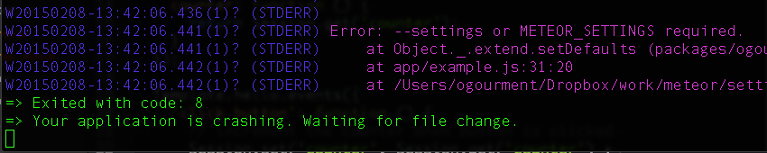

# Reliably initialize `Meteor.settings` [](https://travis-ci.org/ogourment/settings)

This package provides a `MeteorSettings` object with only one function: `setDefaults`. This function works on the client or server.

## Installation
```bash
meteor add ogourment:settings
```

## Provide sensible defaults

Call `MeteorSettings.setDefaults(defaultSettings)` to populate the `Meteor.settings` object with sensible defaults for your app. If you do this in all the source files where you access `Meteor.settings`, this will ensure your app does not crash when accessing a setting, or avoid duplicating the code that checks if the settings are not empty.
You should set the defaults for the settings used in the `.js` file for better modularity. You may call `setDefaults` as many times as you like.

Example:
```javascript
MeteorSettings.setDefaults({
  public: {
    book: { title: "My Story" }
  }
});
...
// code that uses `Meteor.settings.public.book.title`
```

## Alert the user when no settings were provided

Sometimes, there are no sensible defaults. In that case, you want to alert the developer when he forgot to provide a `settings.json` file. This usually only makes sense on the server. In this case, pass `MeteorSettings.REQUIRED` as the second argument. An `Error` will be thrown and the server will crash (nicely).
If you want the settings file to *only* be required in production, pass `MeteorSettings.REQUIRED_IN_PROD`.

Example:
```javascript
MeteorSettings.setDefaults({
  public: {
    book: { title: "My Story" }
  }
}, MeteorSettings.REQUIRED_IN_PROD);
```
...will result in the default "My Story" book title to be used. This will be true in development and the clients. On the server and when deployed on meteor.com or in any other production environment, it will fail with:



## Troubleshooting

1. Make sure to read the [official doc on Meteor.settings](http://docs.meteor.com/#/full/meteor_settings). Note: only `public` settings are passed to the client.
1. A [detailed example](https://github.com/ogourment/settings/commit/36f120980b091e923a94708c084d05cae79c23b7) is provided.
1. Look at the [tests](https://github.com/ogourment/settings/blob/master/src/settings_tests.js) to see what is supported.

Feedback welcome! Please send me an email ogourment @ smarterportal.com, or create an issue.

Thanks to [Sam](https://github.com/samhatoum) for the idea.
